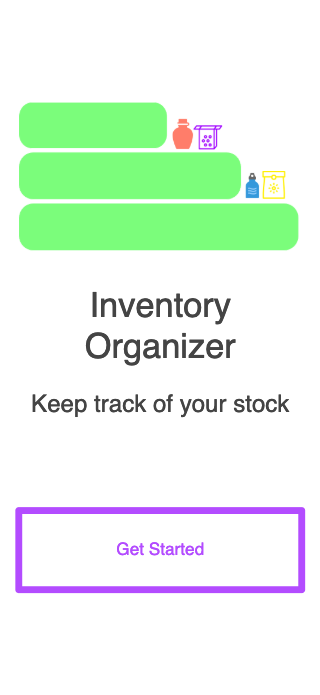
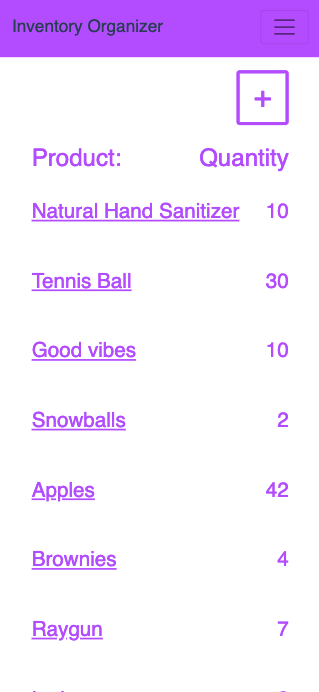
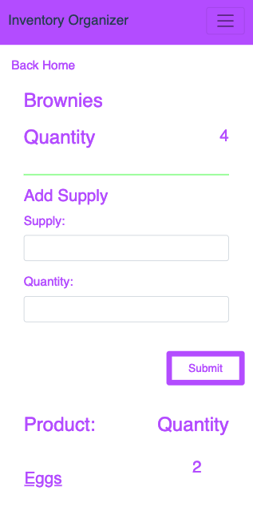

# Inventory Organizer

Website: https://node-inventory-organizer-mc.herokuapp.com/

### Preview Sample
| Home View | Index | Show |
| --- | --- | --- |
|  |  |   |

This app is intended to help people keep track of inventory.
**_Invenotry Organizer_** was created with Node, Express, MongoDB, Handlebars, HTML and CSS.

## Running Locally
Make sure you have [Node.js](http://nodejs.org/) >= 10.11.0 installed.

```sh
git clone https://github.com/campbellmarianna/Node-Inventory-Organizer.git
cd node-inventory-organizer
npm i && nodemon
```

The app should now be running on [localhost:3000](http://localhost:3000/).

User can create a product and add ingredients to that product.

```
Home - https://node-inventory-organizer-mc.herokuapp.com/home
Index - https://node-inventory-organizer-mc.herokuapp.com/
Show - https://node-inventory-organizer-mc.herokuapp.com/products/:id
```


## Version 1 Release Date:
[x] Friday March 22, 2019
